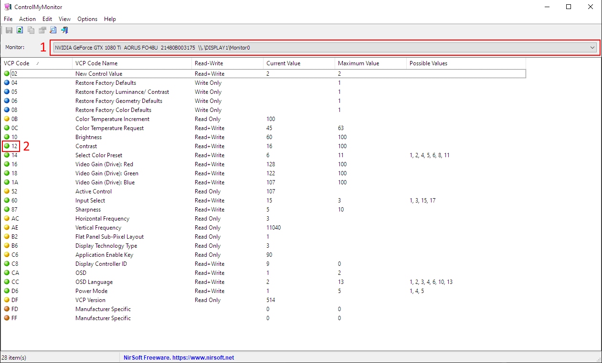

## no_asbl - OLED ASBL prevention tool

---

### **Disclaimer**

**Author takes no responsibility for any damage caused by using this program. Either direct or indirect. This program comes with no warranty and no support.**

---

### **What's that?**
**ASBL** (*Automatic Static Brightness Limiter*) is one of anti burn-in OLED features. It works by limiting screen brightness over time if a static image is detected on the screen. This can become a nuisance when coding or reading text. Some OLED devices allow deactivation of this protection via service menu which can potentially void the warranty. This script tries to prevent ASBL from kicking in by constantly changing OLED contrast by a small amount. **But be aware that this might have negative impact on the panel and cause burn in issues!** If your OLED device supports DDC/CI this script should work for you.

---

### **How to use**

**1.** Apply recommended settings provided on [/r/OLED_gaming](https://www.reddit.com/r/OLED_Gaming/comments/mbpiwy/lg_oled_gamingpc_monitor_recommended_settings/).

**2.** Download and install [AutoIt Full Installation](https://www.autoitscript.com/site/autoit/downloads/).

**3.** Clone this repo or download it in zip format and unpack.

**4.** Download and unpack [ControlMyMonitor by Nirsoft](https://www.nirsoft.net/utils/control_my_monitor.html). Move **ControlMyMonitor.exe** to **src** folder. **no_asbl.au3** is using this application for sending commands to the monitor so make sure both are in the same folder.

**5.** Run **ControlMyMonitor.exe** and write down value for monitor string (1), we are interested only with the part starting with '\\\\.\\'. Also the code for contrast control (2). If nothing is displayed then your device doesn't support DDC/CI and this script won't work for you.

**6.** Before first run configure **src/no_asbl.au3** accordingly:
- ***$change_delay*** - this is the delay between contrast decrementation and incrementation, in milliseconds, default 2000ms (2s).
- ***$cycle_delay*** - this is the delay between contrast switch cycles, in milliseconds, default 60000ms (1min).
- ***$monitor_string*** - it's the value (1) from **ControlMyMonitor.exe**. Starting with a pair of backslashes, in my case it's *\\\\.\DISPLAY1\Monitor0*. It has to be placed between quotes (").
- ***$change_value*** - by how much the contrast should be changed, default 2.
- ***$contrast_code*** - value (2) from **ControlMyMonitor.exe**. In my case it's *12*.

**7.** To test you can set some high ***$change_value***. Let's say your current contrast is **50**, then you can set it to **30**. Execute **src/no_asbl.au3** by double clicking it (if you have AutoIt installed this should execute the script). If your screen got dimmer or blinked (in case you have low ***$change_delay***) then it worked. Alternatively you can check contrast value in the OSD but on some rare occasions this can interfere with the commands sent by the script. If everything is OK then you can set the desired value of ***$change_value***.

---
### **Fine-tuning**
Effectiveness of this script seems to be influenced by what's on the screen and how bright things are. If your contrast is low (~20) then you might need higher ***$change_value*** but at such a low contrast there will be a noticeable flicker. You can increase the contrast and decrease the ***$change_value*** and then lower the brightness a bit. Generally speaking things to tweak are:
- contrast on your TV/monitor
- ***$change_value*** in no_asbl.au3

Little less important:
- ***$change_delay***
- ***$cycle_delay***

It might take a while to land on a good settings because it takes some time for ASBL to kick in. On my Aorus FO48U it's around 5min. Also you can find a short example how it works above. Script was on default values and my monitor Brightness/Contrast was set at 50/40. 

